# newspaper-agency-system
___
## Description
This project helps users track newspapers, their topics and assigned redactors.

DB structure:
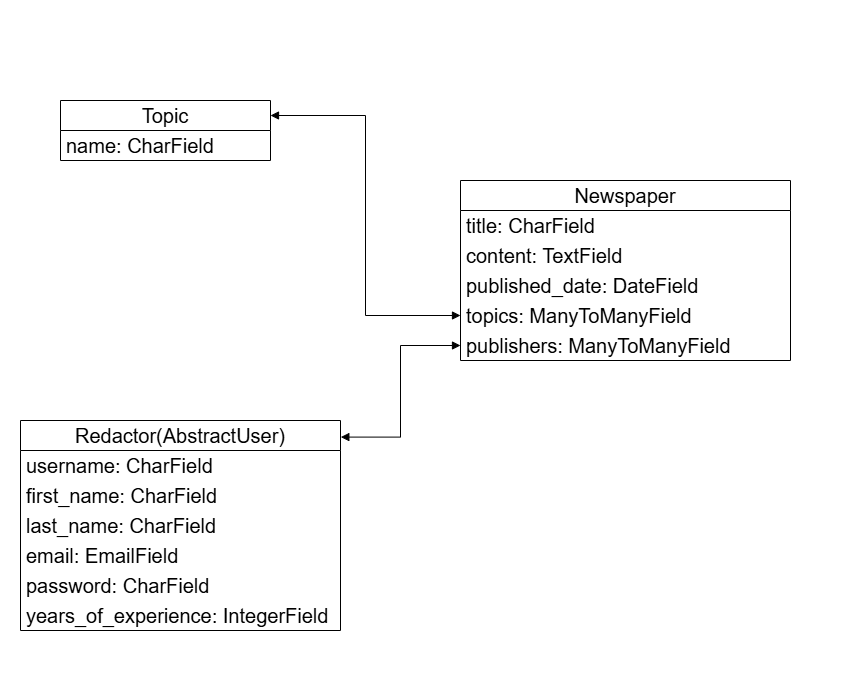

Home page:


Topic list page:
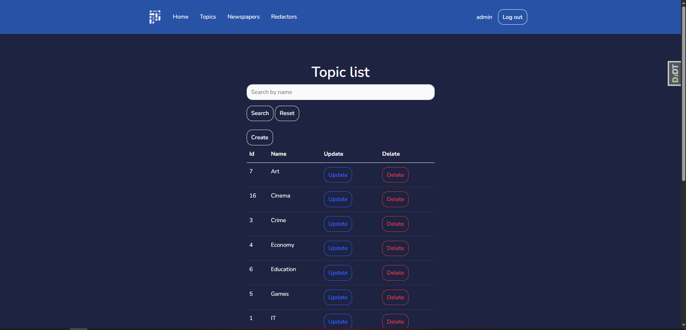

Topic create page:
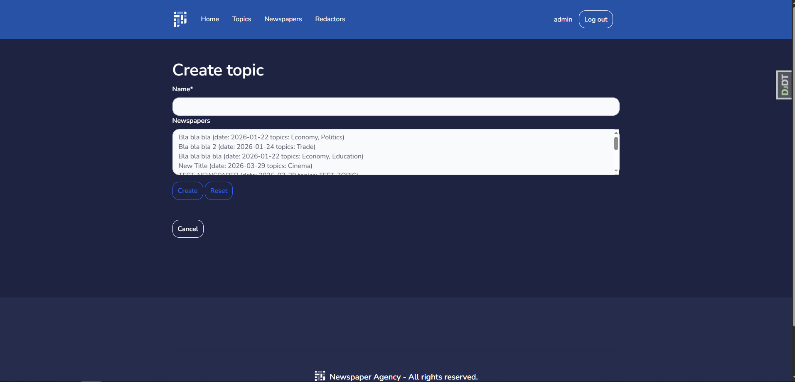

Topic update page:
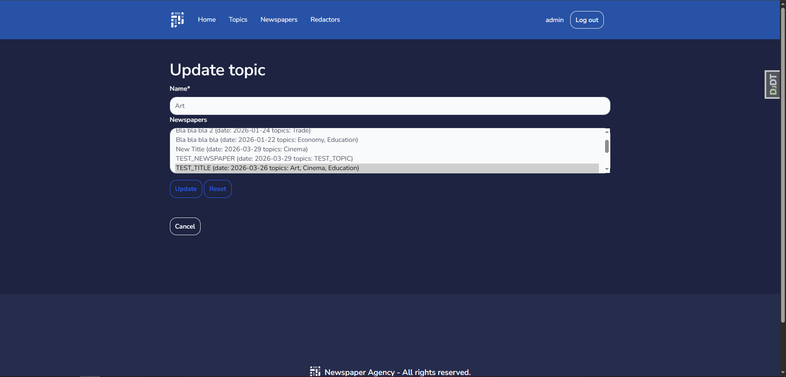

Topic delete page:
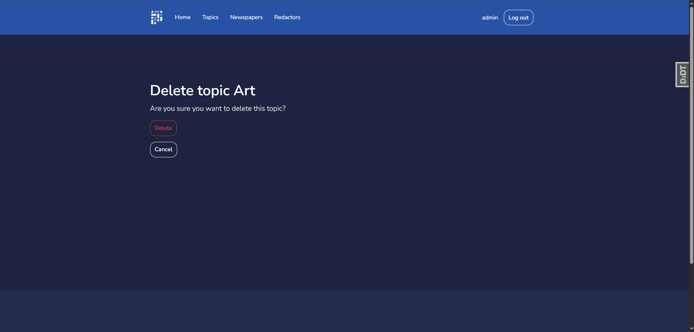

Newspaper list page:
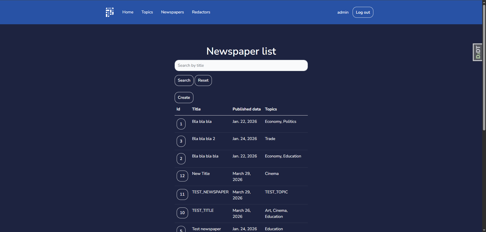

Newspaper detail page:
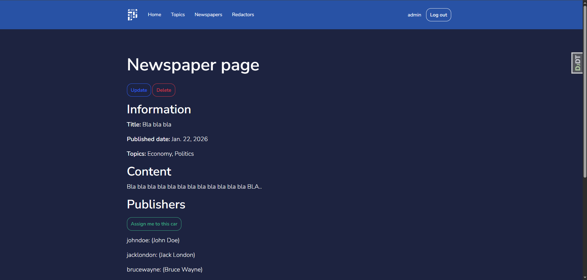

Newspaper create page:
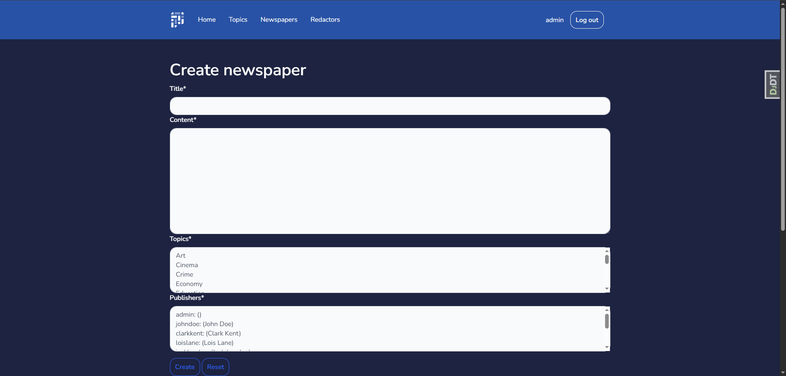

Newspaper update page:
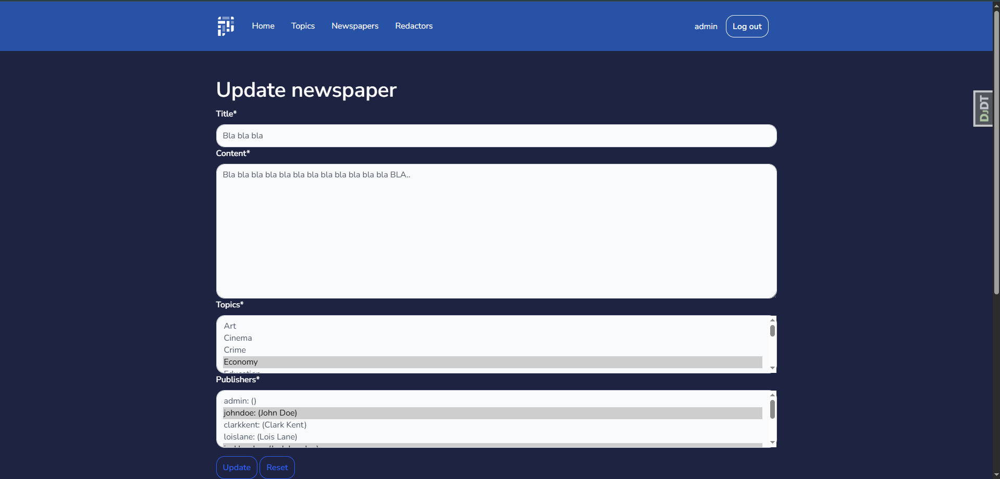

Newspaper delete page:
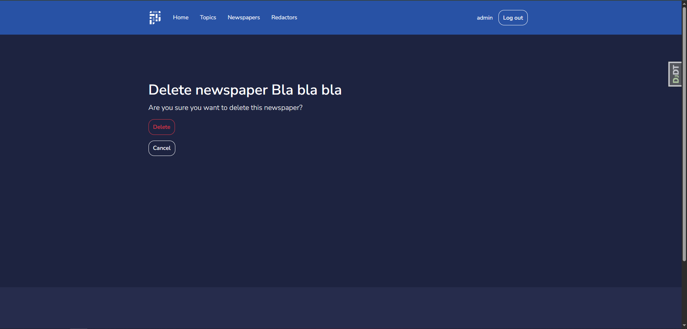

Redactor list page:
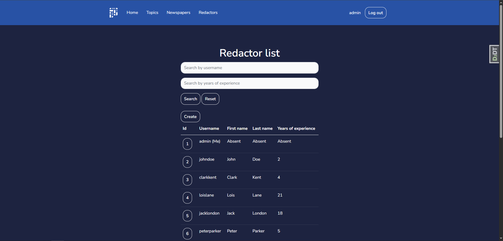

Redactor detail page:
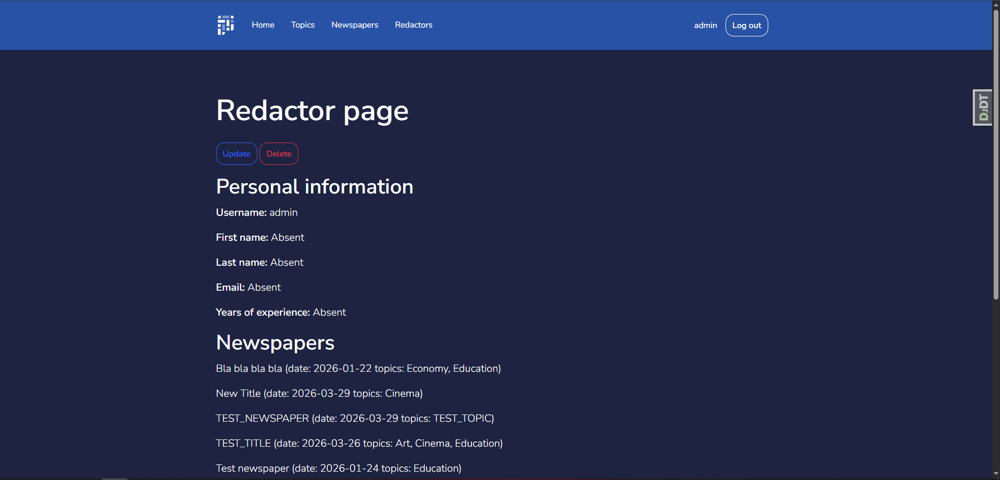

Redactor create page:
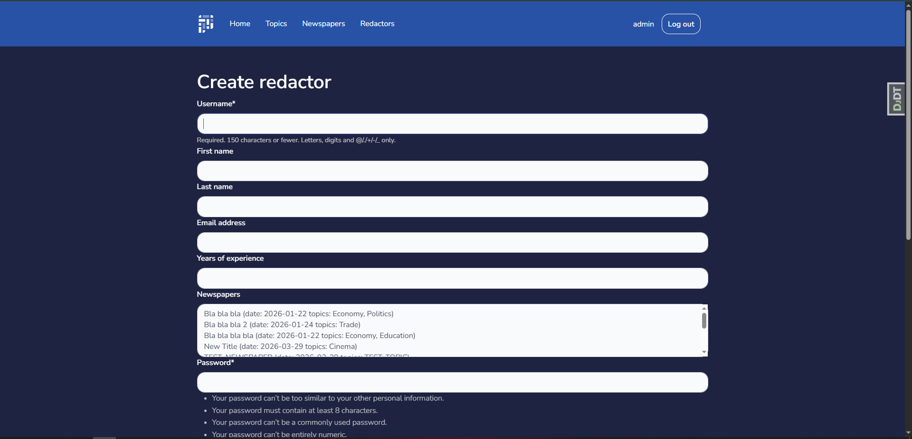

Redactor update page:
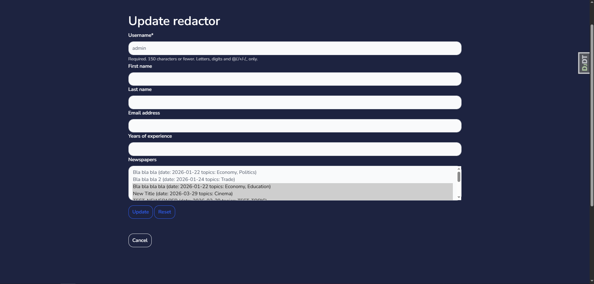

Redactor delete page:
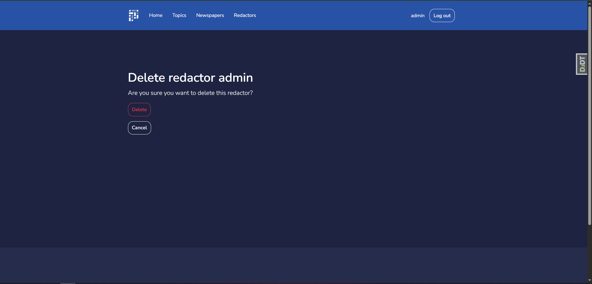

Login page:
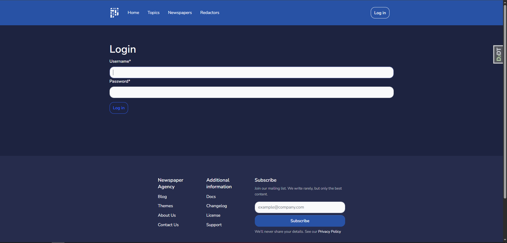

Logout page:
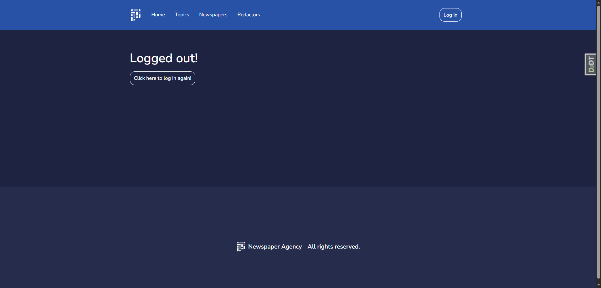

404 page:
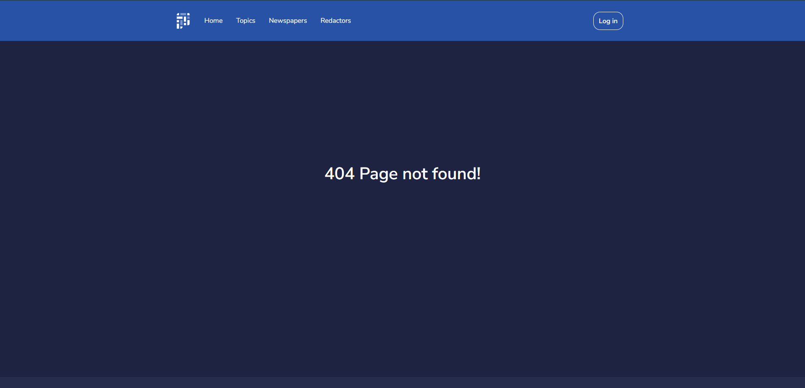
___
## Check it out
[Newspaper agency system project deployed to Render](https://newspaper-agency-system-wpx6.onrender.com)

To view the website, use this user:
```
login: user
password: user12345
```
___
## Installation
1. Clone the repository:
```
git clone https://github.com/bknyrik/newspaper-agency-system.git
```
2. Create a virtual environment `python -m venv .venv`;
3. Activate the virtual environment:
    - Windows - `newspaper_agency_system\Scripts\activate`;
    - macOS/Linux - `source newspaper_agency_system/bin/activate`.
4. Install all dependencies `pip install -r requirements.txt`;
5. Apply migrations `python manage.py migrate`;
6. Run the server `python manage.py runserver`
___
## Usage
Visit `http://127.0.0.1:8000/` in your browser to use the application. And also don't forget to create a superuser:
```python manage.py createsuperuser```
## Contact
Email: knyrikkolesnichenko2004@gmail.com
